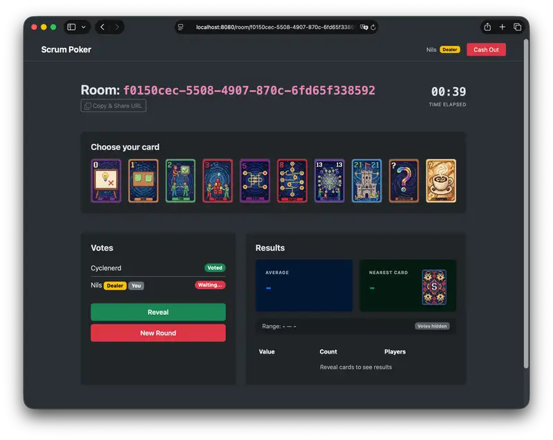

# Scrum Poker

[](#readme)
[](#readme)
[](#readme)
[](#readme)
[](#readme)
[](#readme)
[](https://www.gnu.org/licenses/agpl-3.0)

**Scrum Poker** is a lightweight, real-time estimation tool for Agile teams. It simplifies the sprint planning process with a clean, no-frills interface and instant feedback.



## Features

-   **Real-time Updates**: Uses Server-Sent Events (SSE) for instant vote visibility without refreshing.
-   **No Registration**: Jump straight into a room with a generated session ID.
-   **Ad-Hoc Rooms**: Create a room instantly; rooms persist in memory (flushed to disk on shutdown).
-   **Dealer Controls**: The room creator (Game Master, Dealer) has exclusive rights to **Reveal Cards** and **Reset Votes**.
-   **Standard Deck**: Includes Fibonacci sequence (0, 1, 2, 3, 5, 8, 13, 21), `?` (unsure), and `☕` (break).
-   **Mobile Friendly**: Responsive design works seamlessly on desktop and mobile.

## Getting Started

### Prerequisites

-   [Docker](https://www.docker.com/) or [Podman](https://podman.io/)
-   [Go 1.25+](https://go.dev/) for local dev

### Run with Docker

The easiest way to run Scrum Poker is using the provided Docker configuration.

1.  **Build the image**:

    ```bash
    docker build -t scrumpoker .
    ```

2.  **Run the container**:

    ```bash
    docker run -d -p 8080:8080 --name scrumpoker scrumpoker
    ```

    Access the app at `http://localhost:8080`.

### Run Using Docker Compose

For a more robust setup with persistent storage:

```bash
docker-compose up -d --build
```

### Local Development

1.  **Clone the repository**:

    ```bash
    git clone https://github.com/Cyclenerd/scrumpoker.git
    cd scrumpoker
    ```

2.  **Run the application**:

    ```bash
    go run main.go
    ```

    The server will start on `http://localhost:8080`.

## Usage

1.  **Create a Room**: Go to the homepage and click "Create Room". You become the **Dealer**.
2.  **Invite Team**: Share the URL or Room ID with your team.
3.  **Vote**: Players select a card. Their status changes to "Voted" (card remains hidden).
4.  **Reveal**: The Dealer clicks "Reveal Cards" to show all estimates.
5.  **Reset**: The Dealer clicks "Start New Round" to clear votes for the next story.

## Contributing

Contributions are welcome! Please read our [Contributing Guidelines](CONTRIBUTING.md) for details on our code of conduct and the process for submitting pull requests.

## License

This project is licensed under the **AGPL v3 License**. See the [LICENSE](LICENSE) file for details.
